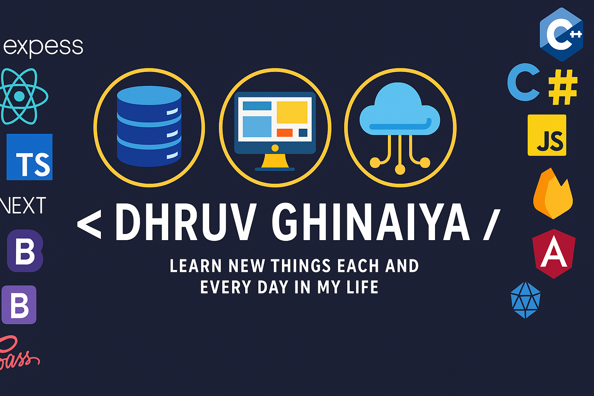

  

<h1 align="center">hii 👋 i'm Dhruv Ghinaiya</h1>

<strong>Graduated with a B.E. in Computer Engineering from S.S. Agrawal Institute of Engineering & Technology, Navsari.</strong>

# 💻 Tech Stack:

### Frontend:
 
 
 

### Backend:
 

### Database:

### Version Control:
 

### Other Tools:
 
 

# 📊 GitHub Stats:
 
 

### 🔝 Top Contributed Repo

---

# 🔗 Connect with me:

  
  
  

